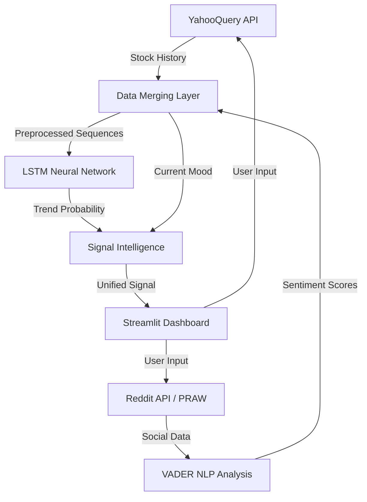

# 📈 StockPulse: AI-Driven Sentiment & Trend Predictor

[](https://stockpulse-bn8f.onrender.com)
[](https://www.python.org/downloads/)
[](https://tensorflow.org)
[](https://stockpulse-bn8f.onrender.com)
[](https://opensource.org/licenses/MIT)

**StockPulse** is a sophisticated financial intelligence platform that fuses deep learning time-series forecasting with real-time social media sentiment analysis. By analyzing the intersection of historical market data and public crowd psychology (Reddit), StockPulse provides a unified "Signal Intelligence" to help investors navigate market volatility.

---

## 🎯 Project Intent
Standard stock prediction models often ignore the "human element"—the hype, fear, and collective sentiment that drives short-term price movements. **StockPulse** bridges this gap by:
1.  **Technical Analysis**: Using Long Short-Term Memory (LSTM) neural networks to identify patterns in historical price data.
2.  **Sentiment Analysis**: Utilizing Natural Language Processing (NLP) to quantify the "mood" of investors on major subreddits like r/wallstreetbets and r/stocks.
3.  **Data Fusion**: Merging these two distinct data streams into a single, actionable recommendation engine.

---

## 🛠️ Tech Stack
| Category | Technology |
| :--- | :--- |
| **Frontend** | [Streamlit](https://streamlit.io/) (Dashboarding & UI) |
| **Machine Learning** | [TensorFlow](https://www.tensorflow.org/) (LSTM Networks), [Scikit-learn](https://scikit-learn.org/) (Preprocessing) |
| **NLP** | [NLTK VADER](https://www.nltk.org/) (Sentiment Intensity Analysis) |
| **Data Ingestion** | [YahooQuery](https://yahooquery.com/) (Market Data), [PRAW](https://praw.readthedocs.io/) (Reddit API) |
| **Visualization** | [Plotly](https://plotly.com/) (Interactive Charts) |
| **DevOps** | [Docker](https://www.docker.com/), [Dotenv](https://pypi.org/project/python-dotenv/) |

---

## 🏗️ Architecture & Workflow



---

## 🚀 Key Features
- **Signal Intelligence Card**: A unified recommendation (STRONG BUY, HOLD, STRONG SELL) based on the combined weight of AI predictions and social sentiment.
- **Dynamic Sentiment Gauge**: A real-time visual representation of the 7-day social mood pulse.
- **Interactive Price Discovery**: Plotly-powered charts allowing users to explore historical price trends.
- **On-Demand AI Training**: Train custom LSTM models for any ticker symbol directly through the web interface.
- **Professional Deployment**: Fully containerized with Docker, making it ready for cloud hosting on Render, AWS, or Railway.

---

## 📥 Installation & Setup

### 1. Clone the Repository
```bash
git clone https://github.com/kamaleshpantra/StockPulse.git
cd StockPulse
```

### 2. Configure Environment Variables
Create a `.env` file in the root directory and add your [Reddit API credentials](https://www.reddit.com/prefs/apps):
```env
REDDIT_CLIENT_ID=your_id
REDDIT_CLIENT_SECRET=your_secret
REDDIT_USER_AGENT=StockPulse/1.0
```

### 3. Run with Python
```bash
# Create and activate virtual environment
python -m venv .venv
source .venv/bin/activate  # On Windows use: .venv\Scripts\activate

# Install dependencies
pip install -r requirements.txt

# Launch application
streamlit run app.py
```

### 4. Run with Docker
```bash
docker build -t stockpulse .
docker run -p 8501:8501 stockpulse
```

---

## 📸 Screenshots
*(Place your Streamlit screenshots in a `screenshots/` directory)*

| Market Discovery | Signal Analysis |
| :---: | :---: |
|  |  |

---

## 🌐 Live Demo
You can access the live application here: **[strangesteet.com](https://strangestreeet.onrender.com/)**
### Deploying to Render
This project is configured for easy deployment on [Render](https://render.com) using the included `render.yaml` Blueprint.

1.  **Fork** this repository to your GitHub account.
2.  **Connect** your Render account to GitHub.
3.  Click **"New +"** and select **"Blueprint"**.
4.  Select your forked `StockPulse` repository.
5.  Render will automatically detect the configuration and prompt you for the required environment variables:
    - `REDDIT_CLIENT_ID`
    - `REDDIT_CLIENT_SECRET`
    - `REDDIT_USER_AGENT`
6.  Click **"Apply"** to deploy.

> [!NOTE]
> **Model Persistence:** On Render's free tier, files created at runtime (like trained models) are ephemeral. For persistent model storage, consider using [Render Persistent Disks](https://render.com/docs/disks) or pre-training your models and including them in the repository.

## 🛡️ Production Best Practices
- **Secrets Management**: Never commit your `.env` file. Use the cloud platform's secret manager.
- **Resource Allocation**: Deep learning models (LSTM) can be memory-intensive. Ensure your hosting plan provides at least 2GB of RAM for smooth performance.
- **API Rate Limits**: The Reddit API has rate limits. Ensure your `REDDIT_USER_AGENT` is unique to avoid throttling.

---

## 📜 License
Distributed under the MIT License. See `LICENSE` for more information.

---

## 🤝 Contact
Your Name - [@yourtwitter](https://twitter.com/yourtwitter) - email@example.com

Project Link: [https://github.com/kamaleshpantra/StockPulse](https://github.com/kamaleshpantra/StockPulse)
